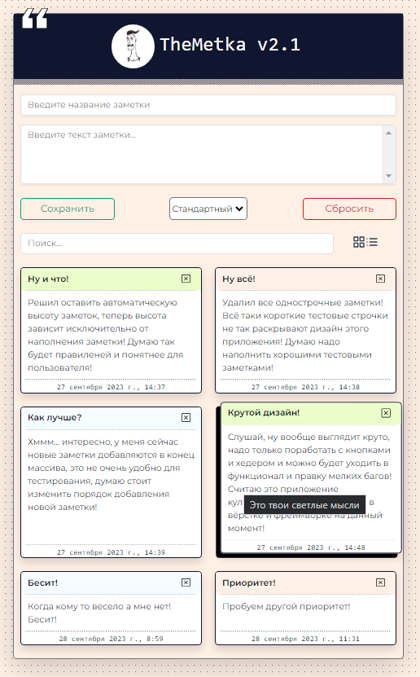

# :floppy_disk: TheMetki-2.1 :books:

### :heavy_exclamation_mark: О приложении:

Эти заметки созданы с :hearts: , скромный функционал только для тех, кому не нужно ничего лишнего! Ваши заметки останутся только на том устройстве с которого вы их сделали, это же так удобно!

### :heavy_exclamation_mark: Функционал приложения:

:white_check_mark: Умопомрачительный дизайн сошедший озарением на автора! Возможность сохранять заметки только лишь на том устройстве с которого она создана!  
:white_check_mark: Лаконичный поиск, ничего лишнего.  
:white_check_mark: Возможность редактировать заголовок заметки, новый заголовок сохраняется при клике на "Enter", отменить редактирование можно нажав клавишу "Esc".  
:white_check_mark: Возможность удалить надоевшую заметку навсегда!  
:white_check_mark: Ну и конечно же, вы сможете создать заметку, назначив ей один из 3-х приоритетов:sparkles:!

### :interrobang: Стек и библиотеки использованные в проекте:

:star2: html  
:star2: css  
:star2: JS  
:star2: SCSS  
:star2: Vue 2.x  
:star2: Vuex  
:star2: Bootstrap + Bootstrap-vue  
:star2: Moment.js  
:star2: Node modules  
:star2: LocalStorage 

### :information_desk_person: TheMetka.ru
See [TheMetka.ru](https://theMetka.ru/).
